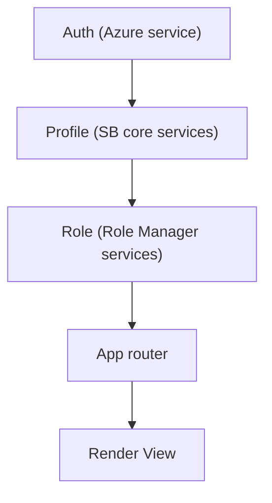

# TO DO LIST OF ITEMS (FOR THIS CODE BASE)

---
## High priority
---

### [x] Auth context for multiple config handling
- [Sample concept](https://ordina-jworks.github.io/architecture/2021/02/12/react-generic-context.html)

### [x] Force node version
- [Sample concept](https://medium.com/codeptivesolutions/want-to-check-node-version-before-project-get-executed-using-script-47cd32c2f1fe)

### [x] PWA minimun features
- Test service worker at dev

### [x] Container
- Add container config ([ref article](https://opensource.com/article/21/7/vs-code-remote-containers-podman))
- Include VSCode ext settings

---
## Low priority
---

### [-] Theme
- Clean and update theme scss files

### [-] Accesibility

### [-] i18n

### [x] API requests
- Enable adittional api endpoints w/o token

### [-] Preferences
- Preferences handling on profile context (secure-web-storage/service)

### [-] SUGGESTED LIBRARIES
- [secure-web-storage](https://www.npmjs.com/package/secure-web-storage)
- react-icons
- react-data-table-component
- date-fns
- react-i18next
- i18next
- i18next-browser-languagedetector
- i18next-http-backend
- usetoaster

# HELP Resources
- [VSCode - Sharing Git credentials with your container](https://code.visualstudio.com/docs/remote/containers#_sharing-git-credentials-with-your-container)

<!-- comments -->
# Mermaid example chart

